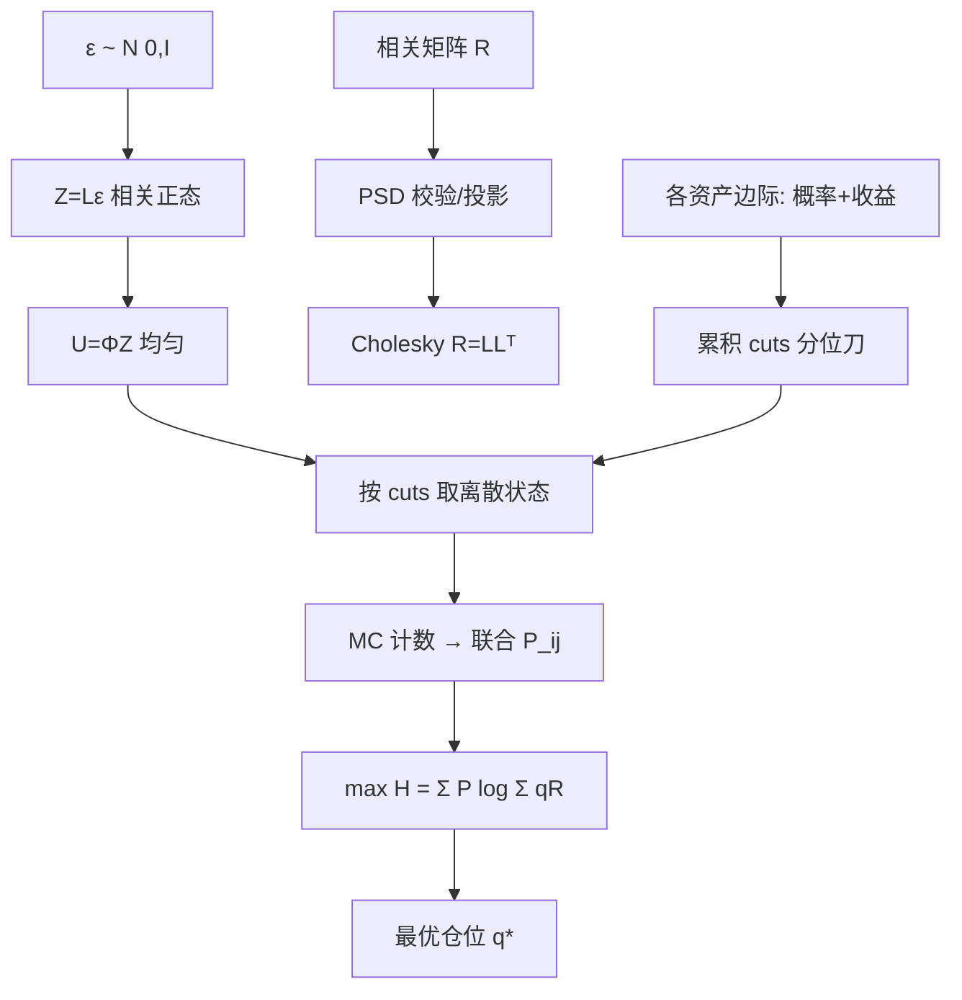

# 高斯 Copula 逐步推导与实现说明

> 对应实现：`correlated.js`（`jointFromCopula`）、`position_sizing.py`（`joint_from_correlation_copula`）  
> 目标：已知各资产**边际分布**和**相关系数**，求出联合情景 \(P(r_A, r_B, \ldots)\)，再代入最大增值熵。

---

## 0. 问题到底是什么

我们手里有的是：

1. **每个资产自己的涨跌分布**（边际）  
   例：资产 A 两态，\(P(A=-0.1)=0.5,\ P(A=+0.3)=0.5\)  
   资产 B 三态，\(P(B=-0.25)=0.3,\ P(B=+0.08)=0.4,\ P(B=+0.5)=0.3\)

2. **资产之间的相关系数** \(\rho=\mathrm{corr}(A,B)\)（或相关矩阵 \(R\)）

我们缺的是：

3. **联合分布** \(P(A=a_i, B=b_j)\)（2×3 共 6 格）

最大增值熵需要的正是 (3)：

\[
H(q)=\sum_{i,j} P(a_i,b_j)\,
\log\bigl(q_0R_0+q_A(1+a_i)+q_B(1+b_j)\bigr)
\]

**Copula 的任务**：用 (1)+(2) 把 (3) 补全。

---

## 1. 为什么不能直接相乘

若 A、B **独立**：

\[
P(a_i,b_j)=P(a_i)\,P(b_j)
\]

有相关时这样乘会错：\(\rho=+1\) 时应「同涨同跌」，\(\rho=-1\) 时应「一涨一跌」，乘积却永远给 0.25/0.25/0.25/0.25（等概率 2×2 时）。

所以需要一个**既尊重边际、又尊重依赖**的联合构造。

---

## 2. Copula：把「边缘形状」和「缠绕方式」拆开

直观比喻：

- 每个资产的收益率分布 = 水管的**横截面形状**（边际）  
- 相关结构 = 水管之间怎么**拧在一起**（copula）

数学上（Sklar 定理的用法）：

\[
F_{A,B}(x,y)=C\bigl(F_A(x),\,F_B(y)\bigr)
\]

- \(F_A,F_B\)：各自的累积分布函数（CDF）  
- \(C:[0,1]^2\to[0,1]\)：**Copula**，描述两个「均匀变量」如何相依  
- 两个坐标在 \(C\) 里都是 \(U(0,1)\) 边缘

换言之：

> 先把每个变量「压扁」成均匀分布，缠绕方式 \(C\) 里只剩下依赖；再把均匀变量「拉回」原来的形状。

---

## 3. 步骤 A：概率积分变换（压扁）

对连续单调 CDF：

\[
U=F_A(A)\sim U(0,1),\qquad V=F_B(B)\sim U(0,1)
\]

含义：把「取值」变成「分位数」。  
A 落在自己分布的 70% 分位 → \(U=0.7\)。

**离散情况**（我们的情形）：用**分段常数** CDF，等价于用累积概率切刀：

资产 B 三态，概率 \(0.3,0.4,0.3\)：

```text
U ∈ (0.00, 0.30] → 状态 1 (r=-0.25)
U ∈ (0.30, 0.70] → 状态 2 (r=+0.08)
U ∈ (0.70, 1.00] → 状态 3 (r=+0.50)
```

这就是代码里的 `marginalCuts` / `pickState`：累积和  
`cut = [0, 0.3, 0.7, 1.0]`。

---

## 4. 步骤 B：用正态变量「拧」出高斯 Copula

关键假设：

\[
(Z_A,Z_B)\sim N\!\left(0,\begin{bmatrix}1&\rho\\\rho&1\end{bmatrix}\right)
\]

即：背后有一对相关的标准正态潜变量。  
再用标准正态 CDF \(\Phi\) 压扁：

\[
U=\Phi(Z_A),\quad V=\Phi(Z_B)
\]

则 \((U,V)\) 的联合分布称为**高斯 Copula** \(C^{Gauss}_\rho\)。

为什么可行：

| 性质 | 原因 |
|------|------|
| \(U,V\) 均匀 | \(\Phi(Z)\sim U(0,1)\) |
| 边缘正确 | 只依赖 \(\Phi\)，与 \(\rho\) 无关 |
| \(\rho\) 控制缠绕 | \(Z\) 的相关系数就是 \(\rho\)；\(U,V\) 的秩相关单调依赖 \(\rho\) |
| 多资产可扩展 | \(Z\sim N(0,R)\)，\(R\) 为相关矩阵 |

> 注：\(\mathrm{corr}(U,V)\neq\rho\) 本身（是 Spearman/Kendall 与 \(\rho\) 的关系）。  
> 我们把用户输入的 \(\rho\) 直接当作**潜变量** \(Z\) 的相关，这是工程上标准且可复现的约定。

---

## 5. 步骤 C：拉回原变量（含离散）

连续时：

\[
A=F_A^{-1}(U),\qquad B=F_B^{-1}(V)
\]

离散时逆 CDF 是阶梯函数，等价于第 3 节的分位切刀：

\[
\text{状态}_k = j \iff \mathrm{cut}_k[j] < U \le \mathrm{cut}_k[j+1]
\]

于是 \((A,B)\) 的联合完全确定：

\[
P(A=i,B=j)=P\bigl(U\in I_i^{A},\ V\in I_j^{B}\bigr)
\]

其中 \(I^A_i,I^B_j\) 是分位区间。

---

## 6. 算法（与代码一一对应）

```text
输入: 各资产状态 [{p,r}, ...], 相关矩阵 R, 样本数 N, 种子 seed
1) 归一化各资产概率, 计算 cuts_k
2) R 对称化 + 对角=1; 若非正定则向 I 收缩 (projectCorrPSD / Cholesky 重试)
3) Cholesky: R = L Lᵀ
4) 重复 N 次:
     ε ~ N(0, I)          # Box-Muller
     Z = L ε              # 相关正态
     U_k = Φ(Z_k)         # normCdf
     状态_k = pickState(U_k, cuts_k)
     联合格索引 += 1
5) 频率 → P(i₁,...,iₙ)
6) grid[i][k] = 该格上资产 k 的收益率 r
输出: (probs, grid) → 代入 max H
```

### 为什么用蒙特卡洛频率而不是硬算积分

- 2×2 时有 **Bernoulli 精确式**（见下），可核对  
- 2×3、3×3… 要算多维正态的「盒子概率」，闭式麻烦  
- 固定种子的 MC 误差约 \(O(1/\sqrt N)\)，\(N=8000\) 时概率误差约 1% 量级，对定仓位足够  
- 代码里 `jointFromCopula` / `joint_from_correlation_copula` 即此路径

---

## 7. 与 2×2 精确式的关系（校验用）

两边都是两态时，设 \(P(A=H)=p_A\)，\(P(B=H)=p_B\)，指示变量相关为 \(\rho\)：

\[
P(HH)=p_Ap_B+\rho\sqrt{p_A(1-p_A)\,p_B(1-p_B)}
\]

其余三格由边际补全：

\[
\begin{aligned}
P(HL)&=p_A-P(HH)\\
P(LH)&=p_B-P(HH)\\
P(LL)&=1-p_A-p_B+P(HH)
\end{aligned}
\]

再把 \(P(HH)\) 裁到 Frechet 边界

\[
\max(0,p_A+p_B-1)\le P(HH)\le\min(p_A,p_B)
\]

这就是 `joint_2x2_correlated` / `joint2x2`。  
高斯 copula 在两态时**近似**给出同一张表；可用它做回归测试锚点。

---

## 8. 手算例子：A 两态 × B 三态

设定（与网页「载入 2×3 示例」一致）：

| A | p | r | B | p | r |
|---|---|---|---|---|---|
| a1 | 0.5 | −0.10 | b1 | 0.3 | −0.25 |
| a2 | 0.5 | +0.30 | b2 | 0.4 | +0.08 |
| | | | b3 | 0.3 | +0.50 |

相关矩阵：

\[
R=\begin{bmatrix}1&0.4\\0.4&1\end{bmatrix}
\]

### 8.1 分位刀

```text
A: cut = [0, 0.5, 1.0]
B: cut = [0, 0.3, 0.7, 1.0]
```

### 8.2 潜变量采样（示意）

取一次样本得到 \(Z=(z_A,z_B)\)，例如 \(z_A=0.25,\ z_B=-0.40\)（已按 \(\rho=0.4\) 相关）。

\[
U_A=\Phi(0.25)\approx 0.5987,\quad
U_B=\Phi(-0.40)\approx 0.3446
\]

查表：

- \(U_A=0.5987\in(0.5,1]\) → A 取 **a2**（r=+0.30）  
- \(U_B=0.3446\in(0.3,0.7]\) → B 取 **b2**（r=+0.08）

这一样本落入联合格 **(a2, b2)**。

### 8.3 重复 N 次

统计 6 格频率，即得 \(\hat P_{ij}\)。  
再算最优仓位：

\[
\max_q \sum_{ij}\hat P_{ij}
\log_2\bigl(q_0R_0+q_A(1+r_{A,i})+q_B(1+r_{B,j})\bigr)
\]

### 8.4 预期性质（测试断言）

| 检查 | 含义 |
|------|------|
| \(\sum_{ij}\hat P_{ij}=1\) | 联合是分布 |
| \(\sum_j \hat P_{ij}\approx p_A(i)\) | 边际还原 |
| \(\rho=0\) 时 \(\hat P_{ij}\approx p_A(i)p_B(j)\) | 退化为独立 |
| \(\rho>0\) 时 \(H^*\) 低于独立 | 正相关吃掉分散红利 |

---

## 9. 多资产：相关矩阵怎么用

\[
Z=(Z_1,\ldots,Z_N)\sim N(0,R),\qquad
R=\begin{bmatrix}
1&\rho_{12}&\cdots\\
\rho_{12}&1&\cdots\\
\vdots& &\ddots
\end{bmatrix}
\]

1. Cholesky：\(R=LL^\top\)（失败则说明 \(R\) 非正定，需投影）  
2. \(\varepsilon\sim N(0,I)\)，\(Z=L\varepsilon\)  
3. 每个 \(k\)：\(U_k=\Phi(Z_k)\) → 按自己的 cuts 取状态  

联合格数 \(=\prod_k n_k\)（2×3=6，3×3×2=18…）。代码限制 400 格。

**注意**：\(N>2\) 时，两两 \(\rho\) **不能唯一决定**完整联合；高斯 copula 是一种标准补全，不是唯一真理。尾部相关、跳跃依赖要另建模型。

---

## 10. 常见疑问

**Q1：为什么不把收益率直接当正态再相关？**  
A：那样边际被绑成正态；copula 允许任意离散边际（2 态、3 态、混合），只借正态做「缠绕」。

**Q2：ρ 是收益率相关还是状态相关？**  
A：实现里 \(\rho\) 是**潜变量 \(Z\) 的相关**。两态且状态与收益仿射对应时，与收益相关同号且单调；多态时不要求 \(\mathrm{corr}(r_A,r_B)=\rho\) 严格相等。

**Q3：ρ 超出可行范围？**  
A：2×2 精确式会裁到 Frechet 边界；copula 路径靠 PSD 投影与均匀边缘自然约束。

**Q4：和最大增值熵怎么接？**  
A：copula 只负责给出 \(\{P_i, r_{ik}\}\)；之后仍是  
\(\max_q\sum_i P_i\log(\sum_k q_k R_{ik})\)，与独立情形同一套求解器。

---

## 11. 推导流程图



---

## 12. 与实现文件对照

| 步骤 | JS (`correlated.js`) | Python (`position_sizing.py`) |
|------|----------------------|-------------------------------|
| 分位刀 | `marginalCuts`, `pickState` | `joint_from_correlation_copula` 内 cuts |
| 边际归一 | `normalizeMarginals` | `_norm_states` |
| 相关处理 | `projectCorrPSD`, `cholesky` | numpy Cholesky + 收缩 |
| Copula 采样 | `jointFromCopula` | `joint_from_correlation_copula` |
| 独立对照 | `jointIndependent` | `expand_joint_from_marginals` |
| 2×2 精确 | `joint2x2` | `joint_2x2_correlated` |
| 求解 | `optimizeCorrelated` | `optimize_portfolio_entropy` / SLSQP |

测试：`test_correlated_joint.py`、`test_correlated_joint.js`（含 2×3 边际还原与 ΔH）。

---

*阅读顺序建议：§0–§5 理论 → §6–§8 跟代码/手算 → §9–§10 扩展与限制。*
